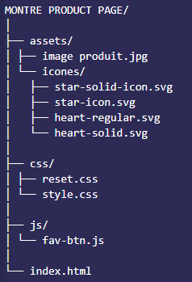

# Projet Carte Produit

Ce projet est une carte produit interactive pour une montre connectée "FitLife Pro 5+".

## Structure du Projet

L'architecture du projet est organisée comme suit :

## Technologies Utilisées

- **HTML5** : Structure de la carte produit.
- **CSS3** : Styles et mise en page, incluant Flexbox pour la mise en page et des media queries pour le responsive design.
- **JavaScript** : Interaction utilisateur, notamment pour le bouton de favoris.

## Fonctionnalités

- **Carte Produit** : Affiche une image, un titre, une description, un numéro de produit, une note avec étoiles, et les prix (ancien et nouveau).
- **Interaction Favoris** : Le bouton de favoris permet de basculer entre un cœur vide et un cœur plein pour indiquer l'ajout ou le retrait des favoris.
- **Responsive Design** : La carte s'adapte aux différentes tailles d'écran grâce à des media queries.

## Détails Techniques

- **CSS Reset** : Un fichier `reset.css` est utilisé pour normaliser les styles par défaut des navigateurs.
- **Effets Visuels** : Les boutons incluent des effets de survol et de clic pour améliorer l'interaction utilisateur.
- **JavaScript** : Le fichier `fav-btn.js` gère l'état du bouton de favoris en utilisant des événements et la manipulation du DOM.

## Comment Lancer le Projet

1. Cloner le dépôt ou télécharger les fichiers.
2. Ouvrir le fichier `index.html` dans un navigateur web.

## Auteur

Charlie Van